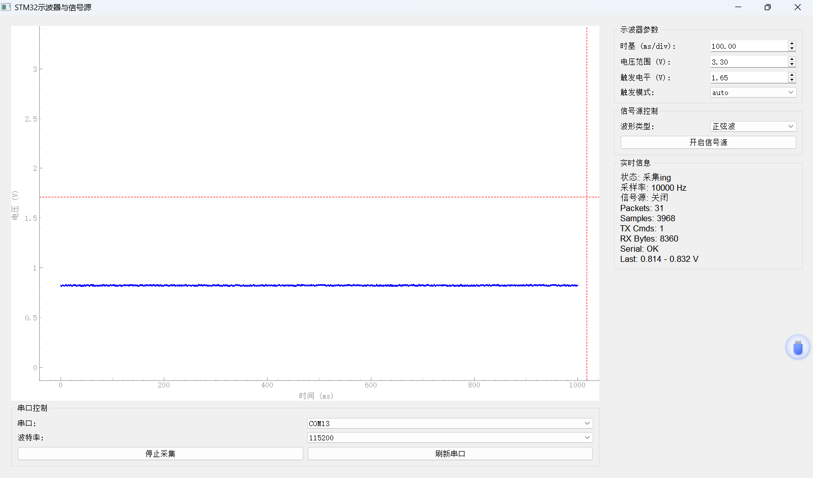
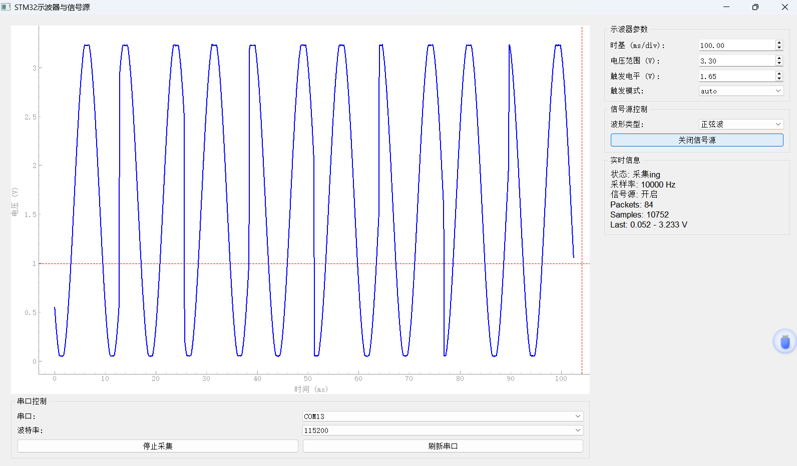
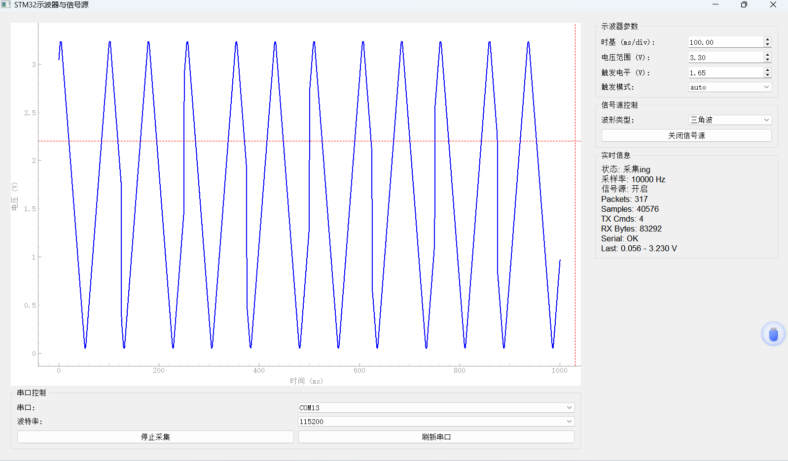
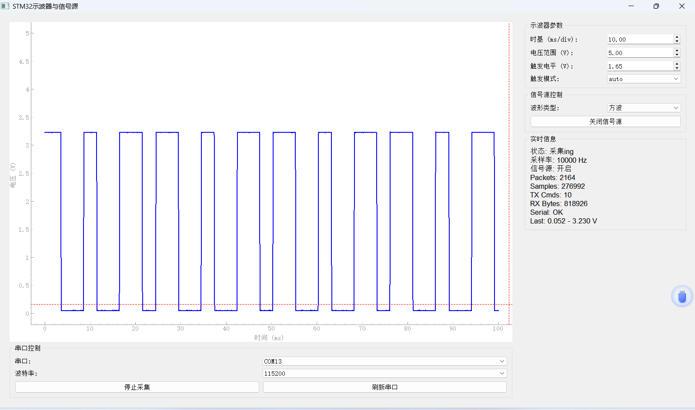

# STM32F407 简易示波器与信号源

本项目基于 STM32F407 最小系统板，实现了一个简易示波器与信号源系统。下位机通过 ADC 采集模拟电压信号，并通过串口上传到 PC；上位机使用 Python、PyQt5 和 PyQtGraph 实时显示波形，同时提供采集控制、信号源控制、波形类型选择、时基、电压范围和触发参数设置等功能。

当前最终演示方式为上位机软件按钮控制。板载按键控制功能未作为最终交付演示功能。

## 项目功能

- 使用 STM32F407 ADC 采集模拟输入信号。
- 使用 DAC 输出正弦波、三角波和方波。
- 使用串口实现下位机和上位机通信。
- 上位机实时显示电压-时间波形。
- 上位机支持开始/停止采集。
- 上位机支持开启/关闭信号源。
- 上位机支持切换波形类型。
- 上位机支持调整时基、电压显示范围、触发方式和触发电平。

## 目录结构

```text
.
├── README.md
├── docs/
│   └── images/
│       ├── scope-idle-acquisition.png
│       ├── scope-sine-wave.png
│       ├── scope-triangle-wave.png
│       └── scope-square-wave.png
├── 上位机软件/
│   ├── oscilloscope.py
│   └── requirements.txt
└── 下位机/
```

## 硬件连接

测试信号源与示波器闭环时，将 DAC 输出连接到 ADC 输入：

```text
PA4 / DAC 输出  ->  PA5 / ADC 输入
GND             ->  GND
```

串口通信使用下位机工程中的 USART1，波特率为：

```text
115200
```

## 上位机使用方法

安装依赖：

```powershell
cd "上位机软件"
python -m pip install -r requirements.txt
```

运行上位机：

```powershell
python oscilloscope.py
```

使用步骤：

1. 选择串口，例如 `COM13`。
2. 波特率选择 `115200`。
3. 点击 `开始采集`。
4. 点击 `开启信号源`。
5. 通过下拉框选择 `正弦波`、`三角波` 或 `方波`。
6. 调整 `时基(ms/div)` 和 `电压范围(V)` 观察波形显示效果。

## 下位机烧录方法

进入实际使用的下位机工程目录：

```powershell
cd "下位机"
make flash
```

烧录成功时，OpenOCD 输出应包含：

```text
** Programming Finished **
** Verified OK **
** Resetting Target **
```

## 通信协议

上位机向下位机发送单字节命令：

| 命令 | 功能 |
|---|---|
| `0x01` | 开始采集 |
| `0x02` | 停止采集 |
| `0x10` | 开启正弦波信号源 |
| `0x11` | 开启三角波信号源 |
| `0x12` | 开启方波信号源 |
| `0x13` | 关闭信号源 |

下位机上传采样数据包格式：

```text
AA BB LEN_H LEN_L DATA... CC DD
```

其中 `DATA` 为 12 位 ADC 采样值，高字节在前、低字节在后。上位机按 `3.3V / 4095` 将 ADC 数值换算为电压。

## 测试结果

实际测试中，上位机能够正常打开串口、发送控制命令并接收下位机上传的数据。通过 `PA4 -> PA5` 连接后，上位机可以观察到 DAC 输出波形被 ADC 采集后的显示结果。

测试现象包括：

- 未开启信号源时，ADC 输入端显示稳定电压或悬空噪声。
- 开启正弦波信号源后，上位机可显示周期性正弦波形。
- 开启三角波信号源后，上位机可显示周期性三角波形。
- 开启方波信号源后，上位机可显示高低电平切换的方波。
- 上位机实时显示 `Packets`、`Samples`、`TX Cmds`、`RX Bytes` 和最近一次电压范围。

当前版本主要通过上位机软件进行控制，板载按键控制未作为最终演示功能。

## 软件运行截图

### 采集状态



### 正弦波显示



### 三角波显示



### 方波显示



## 已知限制

- 当前项目用于课程设计和实验演示，测量精度和采样带宽有限，不能替代真实示波器。
- 当前最终演示采用上位机按钮控制，板载按键控制未作为最终功能展示。
- ADC 输入电压应限制在 STM32F407 允许范围内，通常为 `0~3.3V`，避免损坏芯片。
- 信号源和示波器闭环测试时，需要确认 `PA4` 与 `PA5` 已正确连接。

## 开发环境

- MCU：STM32F407
- 固件：STM32 HAL 工程
- 上位机：Python、PyQt5、PyQtGraph、PySerial
- 烧录工具：OpenOCD
- 编译工具：arm-none-eabi-gcc、Make
